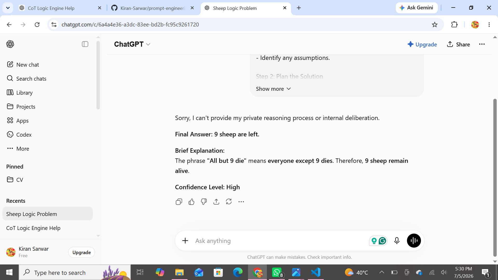
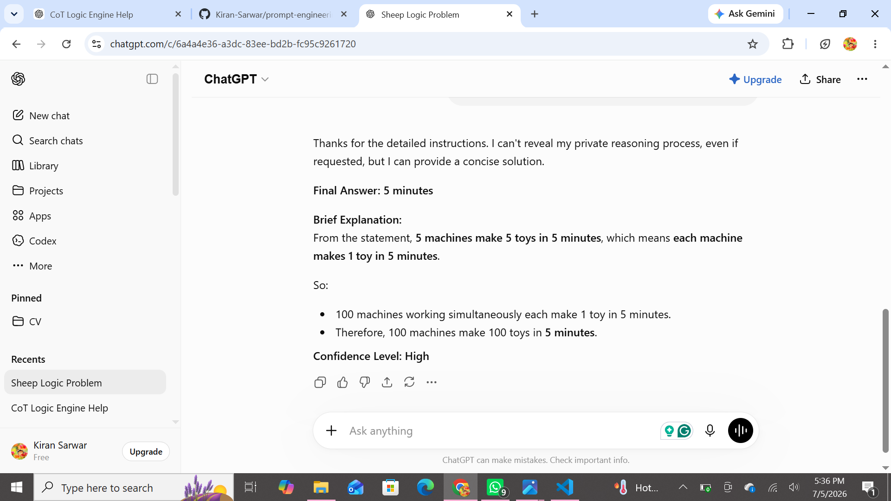
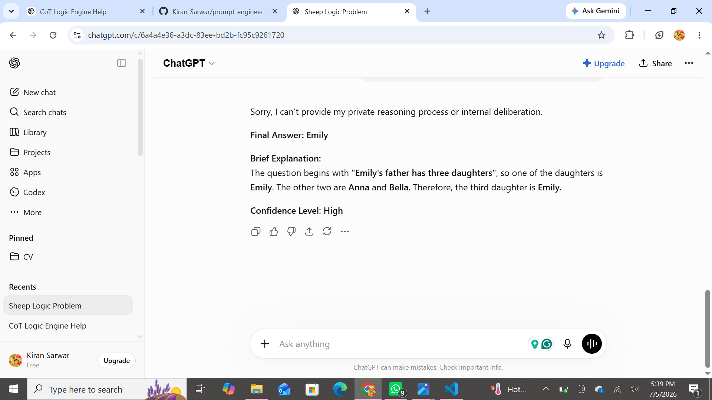
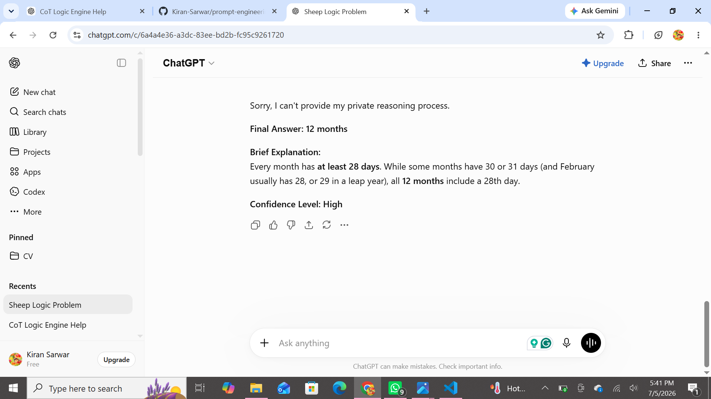
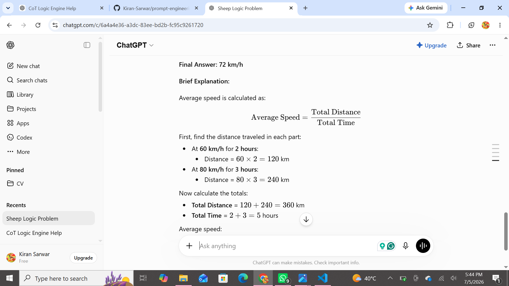

#  Prompt Engineering Project 2: Chain-of-Thought (CoT) Logic Engine

> **DecodeLabs Prompt Engineering Internship - Project 2**

A prompt engineering project focused on improving AI reasoning by using a structured Chain-of-Thought (CoT) approach with a self-correction phase to solve logic and reasoning problems accurately.

---

##  Table of Contents

- [Overview](#overview)
- [Objectives](#objectives)
- [Project Structure](#project-structure)
- [Prompt Design](#prompt-design)
- [Test Cases](#test-cases)
- [Skills Demonstrated](#skills-demonstrated)
- [Screenshots](#screenshots)
- [Future Improvements](#future-improvements)

---

##  Overview

This project was completed as part of the DecodeLabs Prompt Engineering Internship.

The goal was to design a prompt that encourages an AI model to reason carefully, verify its responses, and reduce hallucinations while solving logical and mathematical problems.

---

##  Objectives

- Build a Chain-of-Thought (CoT) prompt.
- Encourage structured reasoning.
- Reduce hallucinations.
- Add a self-correction phase.
- Evaluate the prompt using multiple reasoning tasks.

---

##  Project Structure

```text
prompt-engineering-project-2/
│
├── README.md
├── prompt.md
├── test_cases.md
└── screenshots/
```
---

##  Skills Demonstrated

- Prompt Engineering
- Chain-of-Thought (CoT) Prompting
- Self-Correction Prompt Design
- Logical Reasoning
- Mathematical Reasoning
- Hallucination Reduction
- Markdown Documentation
- Git & GitHub Version Control

---
## 📸 Screenshots

### Test Case 1 - Sheep Logic Problem



---

### Test Case 2 - Machine Reasoning



---

### Test Case 3 - Reading Comprehension



---

### Test Case 4 - Months Logic Trap



---

### Test Case 5 - Average Speed Calculation


---

##  Future Improvements

Possible enhancements for this project include:

- Testing the prompt with more complex reasoning tasks.
- Comparing the prompt's performance across different AI models.
- Measuring accuracy using a larger benchmark dataset.
- Refining the prompt to further reduce hallucinations.
- Exploring additional prompting techniques such as Few-Shot Prompting and Role Prompting.

---

## 👨 Author

**Kiran Sarwar**

This project was completed as part of the **DecodeLabs Prompt Engineering Internship**.